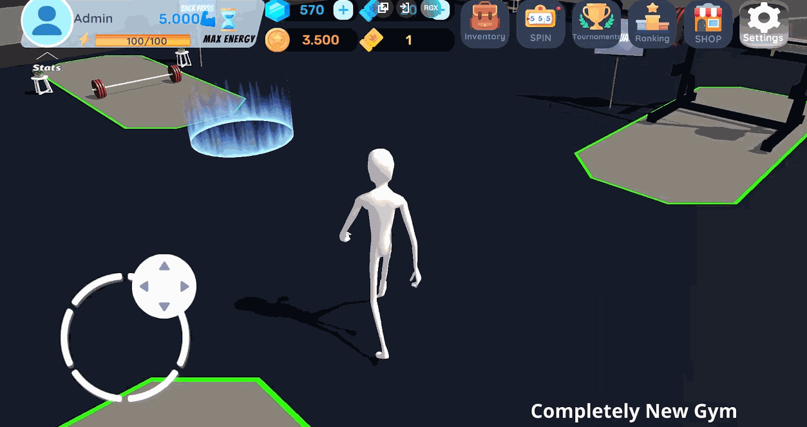

# Hi, I'm Eren Demirkesen.  
## A passionate game developer creating innovative PC and mobile games.

## Viking Survivors: The Last Ragnarök  
Wield ancient weapons and unleash Norse fury in this action-packed roguelite.  
Survive endless waves of monsters, collect mythic weapons, and prove you're the ultimate Viking warrior!  
[Play on Steam!](https://store.steampowered.com/app/3137800/Viking_Survivors_The_Last_Ragnark/)

---

## Mobile Games  

### Gym Game  
A detailed mobile game where you strengthen your muscles, expend energy, and spend in-game tickets to spin a wheel for rewards. Compete in tournaments, train in a boxing area to score points, and use a punching machine to rack up your high scores!  
- **Features:**  
  - Unique time-based mechanics combined with a spin system for rewards.  
  - Integrated in-app purchases, advertisements, and a monetized in-game shop.  

[Watch Gameplay on YouTube!](https://www.youtube.com/@RuxGames-ml8qe/videos)  

---

### Running Game  
A fast-paced running game where you collect coins, earn points, and compete for the top rank on real-time leaderboards.  
- **Features:**  
  - Backend development using IIS servers for real-time leaderboard functionality.  
  - Engaging coin-collecting mechanics with rank-based progression.  

[Watch Gameplay on YouTube!](https://www.youtube.com/shorts/FMmh1yu66yE)  

---

